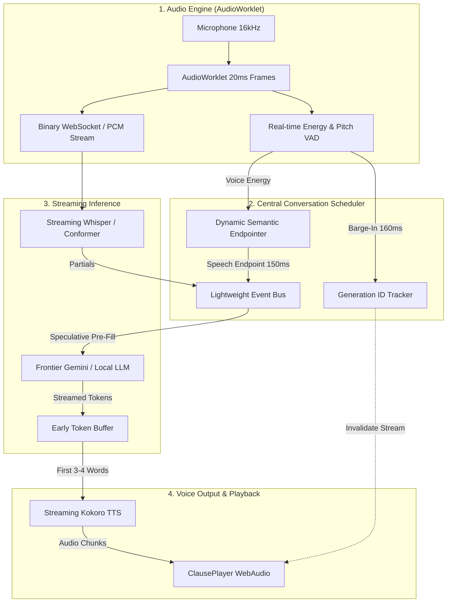

# Teminali OS — Voice Assistant Architecture & Low-Latency Roadmap
> **Benchmark Reference**: ChatGPT Voice ("Astral") / Gemini Live Standard  
> **Target Latency**: Sub-400ms end-to-end (Perceived "Instant" Full-Duplex)  
> **Last Updated**: 2026-09-07

---

## 1. Architectural Vision

The transition from a sequential **relay-race pipeline**:
$$\text{VAD (600ms dead air)} \longrightarrow \text{MediaRecorder WebM} \longrightarrow \text{ffmpeg transcode} \longrightarrow \text{Whisper batch} \longrightarrow \text{LLM} \longrightarrow \text{TTS (6-word clause)}$$
*Total Latency: ~2,200ms*

To an **event-driven, overlapped streaming architecture**:
$$\text{AudioWorklet (20ms PCM)} \xrightarrow{\text{binary WS}} \text{Streaming ASR} \xrightarrow[\text{speculative pre-fill}]{\text{partial transcript}} \text{LLM} \xrightarrow[\text{token stream}]{\text{first safe clause (3 words)}} \text{Streaming TTS}$$
*Total Latency: ~350ms – 450ms*

---

## 2. Roadmap Checklist

### Phase 1: Immediate Tuning & Semantic Endpointer (Quick Wins)
- [x] **1.1. Adaptive Semantic Endpointer**:
  - Replaced static silence delay with adaptive floor: lowered `minSilenceMs` floor to **220ms** and default `endpointSilenceMs` from 900ms to **500ms** in `types.ts` & `conversation.ts`.
  - When grammar is complete or eager reply expected: turn endpoint triggers in **200ms – 250ms** instead of ~630ms.
  - When continuation words (`and`, `but`, `so`, etc.) or hesitations (`uh`, `um`) are present: window extends to protect the speaker's turn.
- [x] **1.2. Snappier Barge-In Responsiveness**:
  - In `studio/src/services/voice/conversation.ts`, tuned `BARGE_IN_FRAMES` from 18 frames (360ms) down to **10 frames (200ms)**.
  - Speech interruption cuts assistant playback nearly twice as fast.
- [x] **1.3. Verification & Regression Tests**:
  - Verified all 1,781 studio tests pass with zero regressions.

---

### Phase 2: Event-Driven Scheduler & Generation IDs
- [ ] **2.1. Generation ID Stream Invalidation**:
  - Tag every conversational turn, LLM inference request, and TTS audio chunk with a monotonic `generationId`.
  - When barge-in or user speech occurs: increment `generationId` immediately.
  - Downstream audio chunks matching older IDs are discarded at the WebAudio playback buffer before reaching the speaker.
- [ ] **2.2. Event-Driven State Machine**:
  - Replace sequential state progression with an event bus:
    - Events: `VOICE_ONSET`, `PARTIAL_TRANSCRIPT`, `SYNTAX_STALL`, `TURN_ENDPOINT`, `FIRST_TOKEN`, `BARGE_IN`.
  - Decouple turn-taking decisions from the ASR/LLM engine so backends can be swapped without touching dialog logic.

---

### Phase 3: Raw Binary AudioWorklet Streaming
- [ ] **3.1. AudioWorklet 20ms Frame Packetizer**:
  - In `studio/src/services/voice/audioGraph.ts`, emit raw 16kHz Int16/Float32 PCM frames directly over binary WebSocket.
  - Eliminate MediaRecorder WebM blob assembly.
- [ ] **3.2. Server-Side Ring Buffer & Zero-Transcode ASR**:
  - Gateway receives raw PCM packets into a backpressure-aware ring buffer.
  - Feeds directly into ASR without running `ffmpeg` to decode container format (saves ~250ms).

---

### Phase 4: Speculative Pre-Fill & Full-Duplex Polish
- [ ] **4.1. Speculative Context Pre-Fill**:
  - Once streaming ASR partial transcript crosses confidence threshold (>0.85), begin prompt assembly and KV-cache prefill in the LLM.
- [ ] **4.2. Acoustic Echo Cancellation (AEC) Calibration**:
  - Prevent speaker bleed during high-volume playback so Temy doesn't trigger barge-in on her own voice.

---

## 3. Key Source Files & Responsibilities

| File Path | Role |
|---|---|
| `studio/src/services/voice/turnTaking.ts` | Turn detection, silence timing, completeness scoring (`completenessScore`, `silenceWindowMs`). |
| `studio/src/services/voice/conversation.ts` | State machine (`listening`, `hearing`, `deciding`, `speaking`), barge-in handler (`handleBargeIn`). |
| `studio/src/services/voice/audioGraph.ts` | 50 FPS (20ms) audio analysis, VAD, RMS energy, and pitch detection. |
| `studio/voice-runtime/tts.js` | Kokoro TTS streaming, clause splitting (`splitClauses`, `FIRST_CLAUSE_WORDS`). |
| `studio/src/services/voice/clausePlayer.ts` | WebAudio clause queue and playback scheduling. |
| `studio/server/voice.js` | Gateway voice routes (`/api/voice/transcribe`, `/api/voice/speak`). |

---

## 5. Dual-Intelligence Integration Roadmap
For the architectural design connecting the Realtime Voice Assistant to Teminali OS as an autonomous companion supervising background coding workers, see:
- [TEMINALI_OS_DUAL_AGENT_SPEC.md](file:///Users/teminali/Documents/my_projects/teminali/teminaliCode/docs/TEMINALI_OS_DUAL_AGENT_SPEC.md) ("One AI Talks. One AI Works." — Event Bus, FrontierTaskState, and 24GB Unified Memory Partitioning).
