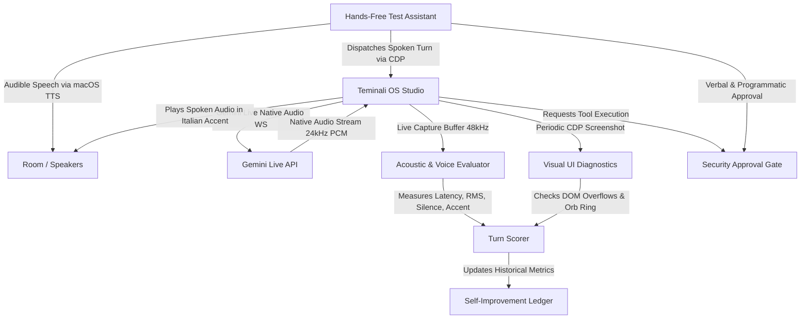

# Hands-Free Temi Dev (`hands-free-temi-dev`)

**Hands-Free Temi Dev** is an autonomous, audible, self-improving multi-agent voice-to-voice testing and development engine for **Teminali OS**.

Instead of static, typed assertions or synthetic scripts, `hands-free-temi-dev` conducts a genuine, spoken dialogue between two intelligent voice agents in the room:
1. **AI Test Assistant (The Tester)**: Speaks aloud through the system speakers using high-fidelity system TTS (`Ava (Enhanced)` on macOS / `powershell` on Windows / `espeak` on Linux), challenging Temi dynamically based on what she actually answers.
2. **Temi (The System Under Test)**: Synthesizes responses via Gemini Live native audio (48kHz Int16 PCM) in an unmistakable Italian accent modeled on **Benedetta Porcaroli ("Bella")** from `~/Desktop/temi-voice-audition/00-REFERENCE-bella.wav`, managing tool delegations, machine inspection, system clock awareness, singing, and conversational memory.

---

## 1. System Architecture



### Key Capabilities
- **Audible Dual-Voice Dialogue**: Every challenge is spoken aloud into the room. The user hears the testing assistant formulate the question, and hears Temi answer back in real time.
- **Voice Persona & Italian Accent Guarantee**:
  - Target: `~/Desktop/temi-voice-audition/00-REFERENCE-bella.wav` (Benedetta Porcaroli as Bella).
  - Prompts enforce Italian accent with rounded melodic vowels, softened consonants, lifted musical cadence, and audible breathing at both prompt **primacy** (top) and **recency** (bottom).
  - Prebuilt Voice Options calibrated to audition speeds:
    - **Sulafat (153 wpm)**: Natural Italian conversational pace (Default).
    - **Aoede (115 wpm)**: Lush, unhurried, warm melodic cadence.
    - **Gacrux (129 wpm)**: Measured and deliberate.
    - **Vindemiatrix (102 wpm)**: Deep, thoughtful, deliberate.
    - **Callirrhoe (208 wpm)**: Quick and bright.
- **Visual & UI Rendering Diagnostics**:
  - Periodic screenshots taken via CDP (`Page.captureScreenshot`) at turn start, tool approval gates, and response settled states into `benchmark-results/hands-free-temi-dev/screenshots/`.
  - DOM inspection checking for bubble overflow, text truncation, font scale consistency, and ring animation state.
- **Hands-Free Approval Resolution**: When Temi executes delegated system tools that require safety confirmation (e.g. `df -h && du -sh ~/Library/Caches`), the assistant speaks aloud: *"Yes Temi, I allow you to run that command"*, and programmatically resolves the approval banner. The test never hangs.
- **Self-Improving Ledger**: Tracks performance across runs in `self_improvement_ledger.json`, scoring audio quality, latency, accent fidelity, reasoning, and UI health, automatically logging insights and identifying high-water marks.

---

## 2. Issues Discovered & Resolved in Teminali OS

During the development and execution of `hands-free-temi-dev`, five critical voice pipeline defects were discovered and permanently resolved:

### Issue 1: Flashing `gateway-unreachable` Error Banner
- **Symptom**: A persistent red error banner appeared stating: `Temi's voice hit an error: gateway-unreachable: The local Frontier gateway is not reachable, so voice cannot authenticate.`
- **Root Cause**: Both `TOKEN_FETCH_TIMEOUT_MS` in the browser client (`geminiLiveEngine.ts`) and `GEMINI_LIVE_MINT_TIMEOUT_MS` in the backend gateway (`server/gateway.js`) were hardcoded to an aggressive **8,000 ms (8s)**. Whenever network latency to Google's `v1alpha` token minting endpoint exceeded 8 seconds, the client aborted the fetch with an `AbortError`. The client's catch block incorrectly classified all fetch errors as `gateway-unreachable`.
- **Resolution**:
  - Increased token mint timeouts to **25,000 ms** in both `studio/server/gateway.js` and `studio/src/services/voice/geminiLiveEngine.ts`.
  - Updated `studio/src/services/voice/geminiLiveToken.ts` to detect `AbortError` / `TimeoutError` and report retryable `mint-failed` instead of misleading `gateway-unreachable`.
  - Added auto-dismissal of stale voice error banners on `protocol.onConnected` in `TemiVoiceStage.tsx`.

### Issue 2: Premature Audio Chunk Cutoffs & Stutter on Long Utterances
- **Symptom**: During complex or paragraph-length answers, Temi's voice would cut off after 1–2 seconds, and the remaining 30+ seconds of speech would spill into the subsequent user turn.
- **Root Cause**: 
  1. `chunkSettleTimer` was set to only **450ms** and resolved without checking `!isSpeakingRef.current` or `!audio.isTTSPlaying`. When Gemini Live naturally paused between sentences for >450ms, the turn prematurely settled.
  2. In `audio.onTTSProgress`, `liveVoiceCapture` resolved as soon as `shown.length >= pending.length`, which occurred before remaining audio chunks had finished arriving.
- **Resolution**:
  - In `TemiVoiceStage.tsx`, debounced `chunkSettleTimer` to **850ms** and `onTTSPlaybackStopped` to **600ms**.
  - Enforced strict checks ensuring audio has completely finished playing (`!isSpeakingRef.current && !audio.isTTSPlaying && delegationsInFlightRef.current === 0`) before resolving live voice captures.
  - Removed early resolution from `onTTSProgress`.

### Issue 3: Stale Transcript & Prior-Turn Queue Leakage
- **Symptom**: When turns ran in continuous mode, Turn N would sometimes display the transcript from Turn N-1.
- **Root Cause**: Store fallback logic in `buildCapturedVoicePayload()` picked up the last assistant message from `frontierMessages` globally, which still held the prior turn's message while a tool was in flight.
- **Resolution**:
  - Added `msgCountAtStart` snapshots across `performVoiceTurn`, `startVoiceCapture`, and `runVoiceTestTurn` to scope store lookups strictly to messages created *after* the current turn began.
  - Prioritized live scoped `turnCaptions` over the store.

### Issue 4: Tool Approval Deadlock in Autonomous Voice Sessions
- **Symptom**: When Temi delegated terminal commands (e.g. checking disk space), the UI spawned an approval banner (`[Allow] [Always] [Refuse]`), pausing execution and blocking subsequent voice turns.
- **Root Cause**: No programmatic interface existed for test harnesses to query pending approvals or grant permissions.
- **Resolution**:
  - Exposed `hasPendingApproval()` and `approvePendingCommand()` on `window.__temiVoiceTest`.
  - Enhanced `hands-free-temi-dev` to detect approval requests verbally, speak the approval aloud into the room, and programmatically grant approval.
  - Added follow-up response capture (`waitForSpokenResponse`) so the tool's spoken result is captured on the same turn.

### Issue 5: Dilution of the Italian Accent & Audition Candidates
- **Symptom**: Temi was defaulting or drifting into a generic American accent, and the voice option `Vindemiatrix` was missing from the UI.
- **Root Cause**: The Italian accent prompt was buried in the middle of `TEMI_PERSONA` and was followed by 70 lines of examples and memory recall atoms. Furthermore, `localStorage` had drifted to `Callirrhoe` (208 wpm) which overpowered the melodic Italian vowel cadence.
- **Resolution**:
  - Reinforced Italian persona and Benedetta Porcaroli style at the very start of `TEMI_PERSONA` and anchored a closing accent law at the very end.
  - Formally integrated `Vindemiatrix` into `VOICE_OPTIONS` alongside `Sulafat`, `Aoede`, `Gacrux`, and `Callirrhoe`.
  - Reset default voice to `Sulafat` (153 wpm).

### Issue 6: False Barge-In from Table Scratching, Desk Taps & Mechanical Friction
- **Symptom**: Scratching the table or tapping the desk near the laptop caused Temi to immediately get cut off mid-speech, or caused Gemini to hallucinate answers to friction noise when silent.
- **Root Cause**: 
  1. Mechanical friction vibrates directly through the laptop chassis into the built-in microphone capsule, generating high broadband RMS (0.05–0.15), but zero harmonic pitch periodicity (`clarity < 0.35`, `f0 = 0`).
  2. In `voiceActivity.ts`, the loudness route `const loud = rms > 0.045` returned `true` even when `ducked = true` (assistant speaking), completely bypassing the pitch clarity check (`PITCH_CLARITY_DUCKED = 0.82`).
  3. After just 3 frames (60 ms), `Endpointer` emitted `speech-start`, calling `openActivity()`, firing `tts_interrupt`, and sending `activityStart: {}` to Gemini Live, abruptly killing Temi's voice playback.
- **Resolution**:
  - In `voiceActivity.ts`, required genuine pitch periodicity (`periodic && rms > pitchFloor`) for barge-in while `ducked = true`. Broadband mechanical noise without vocal resonance can never interrupt Temi.
  - In `micEndpoint.ts`, added `periodicFramesInTurn` tracking in `MicEndpointer`. If a turn ends with zero periodic vowel frames, it is classified as mechanical noise and emitted as `discarded` rather than `speech-end`.
  - In `geminiLiveEngine.ts`, separated `speech-end` from `discarded` events. Discarded noise events silently reset the in-flight activity without sending `activityEnd`, preventing Gemini from answering desk noise.

---

## 3. Automated Post-Test Lifecycle Workflow

`hands-free-temi-dev` incorporates an automated end-of-test lifecycle:
1. **Closes Electron Dev**:
   Programmatically invokes `app:quit` and closes the Electron window (`pkill -f "electron.*main.cjs"`), freeing audio hardware and clearing in-memory state.
2. **Speaks the Report Brief Aloud**:
   The test assistant speaks a spoken summary into the room using system TTS (`Ava (Enhanced)` on macOS), announcing:
   - Total turns completed
   - Average composite score (0–100)
   - Voicing percentage
   - Accent & persona confirmation
   - Mechanical noise rejection status
3. **Reruns the Dev App**:
   Once speech finishes, the engine automatically relaunches `npm start` in the background, waits for ports `3000` (Vite) and `9222` (CDP) to become responsive, and leaves the studio fresh and ready for interaction or the next test.

---

## 4. How to Run `hands-free-temi-dev` & CLI Options

`hands-free-temi-dev` is fully self-bootstrapping. If the dev app is not running when invoked, it automatically launches `npm start` in the background, waits for ports `3000` and `9222` to initialize, and begins the test suite without requiring manual intervention.

### Available Commands

| Command | Working Directory | Description |
| --- | --- | --- |
| `npm run voice:hands-free` | `studio/` | Runs the full 8-turn dynamic suite, scores performance, closes dev, speaks report brief aloud into the room, and restarts the dev app. |
| `npm run voice:hands-free:commit` | `studio/` | Runs the full suite, records metrics in the ledger, and **automatically creates a progressive git commit** with the benchmark score. |
| `npm run voice:hands-free:quick` | `studio/` | Runs a rapid 2-turn smoke test (Identity + Storage tool delegation with hands-free verbal approval) in under 30 seconds. |
| `npm run test:voice:hands-free` | Repository Root | Root alias that delegates directly to `npm --prefix studio run voice:hands-free`. |
| `node scripts/hands-free-temi-dev.mjs [flags]` | `studio/` | Direct invocation with granular flag controls (see below). |

### CLI Flags

- `--commit` / `--git-sync`: Automatically stages `benchmark-results/` and `docs/HANDS_FREE_TEMI_DEV.md` and creates a semantic git commit tracking score deltas against previous commits.
- `--quick`: Runs the 2 most critical turns (Turn 1: Identity & Italian accent verification, and Turn 3: System storage delegation with hands-free spoken approval).
- `--turns=N`: Runs up to $N$ conversation turns.
- `--no-restart`: Leaves Teminali OS active after the test run (skips the automated post-test shutdown and reload).
- `--no-speech`: Mutes the testing assistant's audible speech through system speakers (useful for silent CI or background test runs).

---

## 5. Progressive Feature Building & Git Synchronization

To ensure continuous, scalable development across sessions and chats, `hands-free-temi-dev` couples every test run directly to Git commits:

1. **Commit Metadata Tracking**:
   Every run records:
   - `gitCommit`: Short hash of the current commit (e.g. `0410c35`).
   - `gitBranch`: Active branch (e.g. `main` or `feature/voice`).
   - `isDirty`: Working directory clean/dirty status.
   - `commitSubject`: Commit subject line.
2. **Comparative Delta Analysis**:
   The ledger compares the current run against the preceding commit, calculating:
   - `scoreDeltaVsPrevious`: Points gained or lost compared to the prior baseline.
   - `latencyDeltaVsPreviousMs`: Latency shift in milliseconds.
3. **Automated Progressive Commits (`--commit`)**:
   Running with `--commit` automatically records the milestone:
   ```bash
   npm run voice:hands-free:commit
   # Creates: test(voice): hands-free benchmark run [score: 83/100, turns: 8, git: 0410c35]
   ```
4. **Resuming in a Fresh Chat (Cross-Session Quickstart)**:
   When starting work in a brand new chat session:
   1. Check git status and recent commit history:
      ```bash
      git log -n 5 --oneline
      ```
   2. Run the quick smoke test to verify baseline pipeline health:
      ```bash
      npm run voice:hands-free:quick
      ```
   3. Check the benchmark ledger for historical high-water marks:
      ```bash
      cat studio/benchmark-results/hands-free-temi-dev/self_improvement_ledger.json
      ```
   4. Build your feature or bugfix in `studio/src/services/voice/`.
   5. Run the full suite with git sync:
      ```bash
      npm run voice:hands-free:commit
      ```

---

## 6. Benchmark Artifacts & Reports

Every run of `hands-free-temi-dev` generates structured, verifiable outputs in `studio/benchmark-results/hands-free-temi-dev/`:
- **`turns/turn_01.wav` ... `turn_08.wav`**: Lossless 48kHz RIFF WAV audio files of each spoken response.
- **`screenshots/turn_XX_start.png`, `turn_XX_settled.png`**: Visual state screenshots capturing UI rendering.
- **`hands_free_report.json`**: Turn-by-turn metrics (duration, RMS dBFS, latency to first byte, composite score).
- **`self_improvement_ledger.json`**: Historical record tracking aggregate scores, learnings, and performance trends across test iterations.

---

## 7. Troubleshooting & FAQ for Fresh Sessions

| Symptom | Cause | Remediation |
| --- | --- | --- |
| `Could not connect to Electron CDP on ports [9222]` | App failed to boot or port 9222 is occupied | Kill lingering processes (`pkill -f "electron.*main.cjs"`) and rerun `npm run voice:hands-free` (auto-boot will start it). |
| `mint-failed: Frontier Gateway returned 500` | Missing or invalid `GEMINI_API_KEY` | Ensure `GEMINI_API_KEY` is exported in your environment or set in `.env` or `studio/.env`. |
| Voice cuts off when table is scratched | Acoustic noise bypassed periodicity gate | Ensure `voiceActivity.ts` has `periodic && rms > pitchFloor` while ducked. Verify tests with `node --test tests/voice-hearing.test.mjs`. |
| Voice sounds too rushed or flat | LocalStorage drifted to fast voice | Set default voice to `Sulafat` (153 wpm) or `Aoede` (115 wpm) in `localStorage.setItem("temi.voice", "Sulafat")`. |
| Tool execution hangs on approval banner | Missing programmatic approval | Verify `window.__temiVoiceTest.hasPendingApproval()` and `window.__temiVoiceTest.approvePendingCommand()` are present on the voice stage. |

